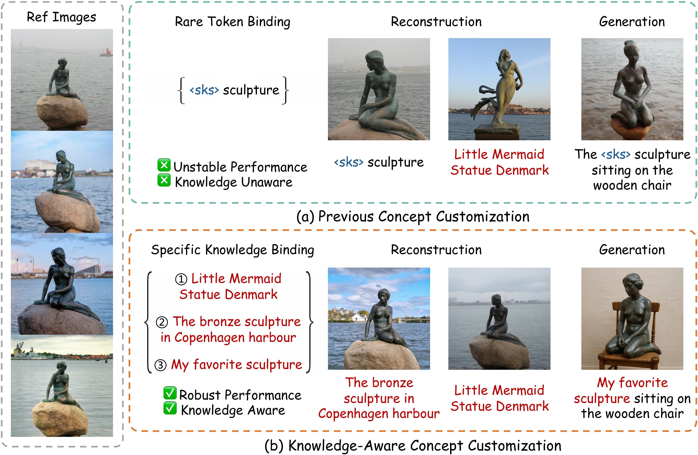

<!-- 页面基础数据配置：定义首页路径、标题、摘要和跳转别名 -->







<!-- 首页顶部个人简介区域：锚点与 About Me 标题 -->

# 🌴 About Me

<!-- 首页顶部个人简介正文：学校、合作导师、研究方向和实习意向 -->
I am a master's student at Tsinghua University, under the supervision of [Prof. Xiu Li](https://www.sigs.tsinghua.edu.cn/lx/main.html). I'm now a visiting student at the [LONG Group](https://long-group.cse.ust.hk/), Hong Kong University of Science and Technology (HKUST), working with [Prof. Long Chen](https://zjuchenlong.github.io/). I obtained my B.Eng in Computer Science and Technology at Harbin Institute of Technology (Shenzhen) in 2024.

My research interests lie in **_Computer Vision_**, particularly in visual content generation such as Concept Customization ([MultiBooth](https://multibooth.github.io/)), Customized Editing ([InstantSwap](https://instantswap.github.io/)).

_I am actively seeking for research internship opportunities in either academia or industry. Please feel free to contact me via email._

<!-- 首页新闻区域：新闻标题、滚动容器、样式和时间线内容 -->
<html lang="en">
<head>
<meta charset="UTF-8">
<title>News</title>

</head>
<body>

<h1>🔥 News</h1>

  <ul>
  <li class="news-item">
      
Mar 2026

      
 Excited to release <a href="https://chenyangzhu1.github.io/MoKus/">MoKus</a>, A novel framework for knowledge-aware concept customization through cross-modal knowledge transfer, enabling robust and high-fidelity customized generation. 

    </li>
  <li class="news-item">
      
Sep 2025

      
 Join LONG Group@HKUST as a visiting student. 

    </li>
  <li class="news-item">
      
Jan 2025

      
<a href="https://instantswap.github.io/">InstantSwap</a> is accepted by ICLR2025. 

    </li>
    <li class="news-item">
      
Dec 2024

      
<a href="https://multibooth.github.io/">MultiBooth</a> is accepted by AAAI2025. 

    </li>
    <li class="news-item">
      
Dec 2024

      
Excited to release <a href="https://instantswap.github.io/">InstantSwap</a>, an efficient customized concept swapping method across sharp shape differences. 

    </li>
    <li class="news-item">
      
Apr 2024

      
Excited to release <a href="https://multibooth.github.io/">MultiBooth</a>, a novel and efficient multi-concept customization method. 

    </li>
    <li class="news-item">
      
Dec 2023

      

        Started to cooperate with <a href="https://mayuelala.github.io/">Yue Ma</a>.
      

    </li>
    <li class="news-item">
      
Aug 2023

      

        Started to cooperate with <a href="http://kailigo.github.io/">Dr. Kai Li</a>.
      

    </li>
    <li class="news-item">
      
Jul 2023

      

        Awarded as an outstanding camper in Tsinghua University Summer Camp.
      

    </li>
    <li class="news-item">
      
Apr 2023

      

        Started internship in Professor Li Xiu’s research group.
      

    </li>
  </ul>

</body>
</html>

<!-- 首页论文区域：论文列表标题 -->
# 📝 Publications

<!-- 首页论文卡片：MoKus 论文信息 -->

 <strong>MoKus: Leveraging Cross-Modal Knowledge Transfer for Knowledge-Aware Concept Customization</strong>

**<u>Chenyang Zhu</u>**, Hongxiang Li, Xiu Li, Long Chen $^{\dagger}$

*arXiv preprint arXiv:2603.12743, 2026*

A novel framework for knowledge-aware concept customization through cross-modal knowledge transfer, enabling robust and high-fidelity customized generation.

<!-- 首页论文卡片：InstantSwap 论文信息 -->

 <strong>InstantSwap: Fast Customized Concept Swapping across Sharp Shape Differences</strong>

**<u>Chenyang Zhu</u> $^{\*}$**, Kai Li $^{\*,\dagger}$, Yue Ma $^{\*}$,  Longxiang Tang, Chengyu Fang, Chubin Chen, Qifeng Chen, Xiu Li $^{\dagger}$

*In International Conference on Learning Representations (ICLR), 2025*

A novel training-free customized concept swapping framework, which enables efficient concept swapping across sharp shape differences.

<!-- 首页论文卡片：MultiBooth 论文信息 -->

 <strong>MultiBooth: Towards Generating All Your Concepts in an Image from Text</strong>

**<u>Chenyang Zhu</u>**, Kai Li $^{\dagger}$, Yue Ma, Chunming He, Xiu Li $^{\dagger}$

*In The AAAI Conference on Artificial Intelligence (AAAI), 2025*

A novel and efficient technique for multi-concept customization in image generation from text.

<!--
首页实习经历区域：实习标题与经历条目
# 💻 Internships

- _2023.04 - 2024.8_, Professor Li Xiu’s [research group](https://thusigsclub.github.io/thu.github.io/index.html) at Tsinghua University, Shen Zhen, China.

---
-->

<!-- 首页底部访问统计区域：ClustrMaps 地图脚本 -->

